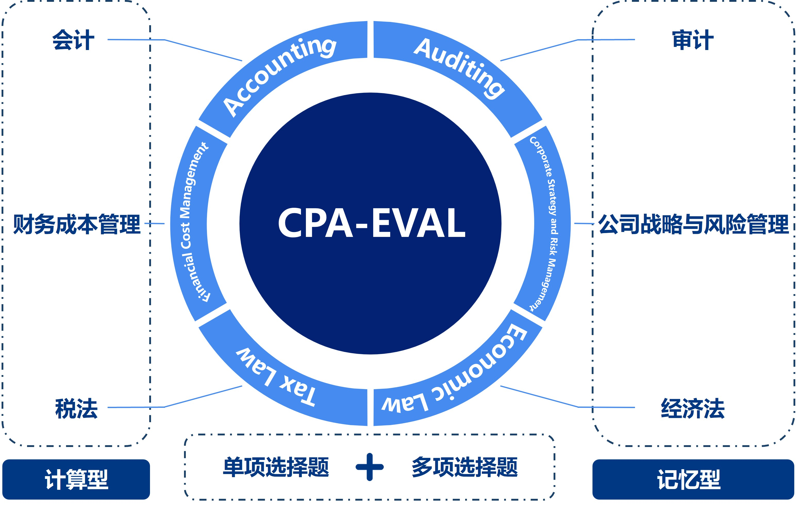
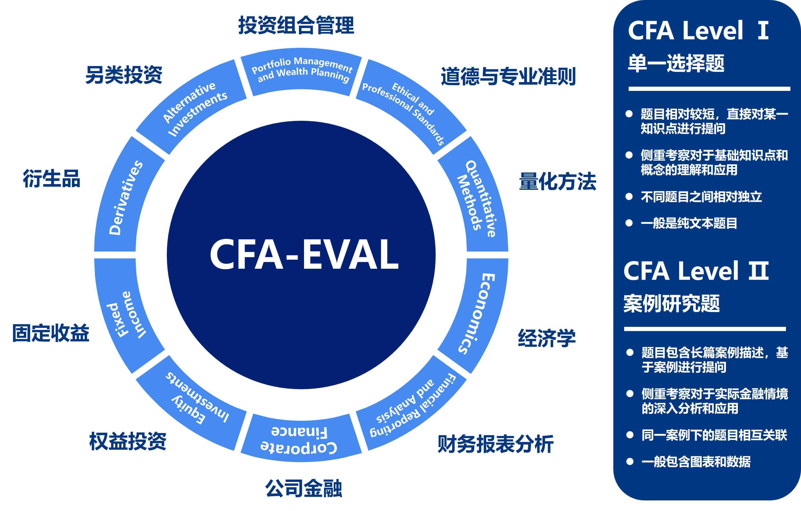

# FinKnowledgeEval: 金融知识评估基准

# ✨ 简介

近年来，通用大模型（LLMs）在人工智能领域取得了显著进展，尤其是在处理复杂的自然语言任务方面。然而，金融领域对这些模型的具体应用和测试仍然相对缺乏。为了补充这一空白，我们提出了一种新的评估基准：**FinKnowledgeEval**。

FinKnowledgeEval旨在评估通用大模型在处理金融相关知识和问题时的能力。此基准专注于金融专业知识，包括但不限于会计、审计、投资、经济学、税法等方面。FinKnowledgeEval包括两个主要测试集，分别针对CPA（注册会计师）和CFA（特许金融分析师）考试，旨在考察通用大模型在金融领域的知识储备水平和逻辑推理能力。

通过FinKnowledgeEval，我们希望能够更深入地了解通用大模型在处理复杂和专业化金融知识方面的能力。这不仅有助于推动金融领域的人工智能应用发展，也为未来更广泛的行业应用提供了重要的基础。

# ❤️ 数据集介绍

## **CPA-Eval数据集**
  
  CPA-Eval数据集涉及会计、财务成本管理、税法、审计、公司战略与风险管理和经济法六大科目，全面考察通用大模型在会计、审计、税法等领域的能力。

  从题目特点来看，六大科目可以分为 **计算型** （评估模型的金融逻辑推理能力）和 **记忆型** （评估模型的金融知识储备水平）。其中计算型主要包括会计、财务成本管理和税法，记忆型主要包括审计、公司战略与风险管理和经济法。

  从题目类型来看，测试题目可以分为 **单项选择题** 和 **多项选择题** 。相比于单项选择题，多项选择题要求通用大模型从多个选项中选择一个以上的正确答案，更加考验通用大模型的综合分析和判断能力。同时，多项选择题的评估方式也更加复杂。
  


下面是 会计科目 **单项选择题** 和 **多项选择题** 示例：

- **单项选择题** 

```
id: 0
question: 下列各事项中，各公司应按照股份支付会计准则处理的是（ ）。
A: 大海公司以自身普通股授予其子公司管理人员
B: 飞鸟公司分配现金股利给其股东
C: 青山公司租赁房屋给在职员工免费使用
D: 绿水公司用外购产品分配给在职员工
answer: A
expanation:
解析：股份支付，是指企业为获取职工和其他方提供服务而授予权益工具或者承担以权益工具为基础确定的负债的交易。选项A：大海公司以自身普通股授予其子公司管理人员，属于以权益结算的股份支付，应按照股份支付会计准则处理，因此，选项A正确。选项B：飞鸟公司分配现金股利给其股东，属于对已有权益的股东进行分红，不适用股份支付准则。因此，选项B错误。选项CD：租赁房屋给在职员工免费使用、用外购产品分配给在职员工均属于非货币性福利，应按照职工薪酬准则进行会计处理，因此，选项CD错误。综上所述，本题答案为选项A。
```

- **多项选择题** 

```
id: 0
question: 企业使用信用衍生工具管理金融工具（或其组成部分）的信用风险敞口时，将其指定为以公允价值计量且其变动计入当期损益的金融工具需要满足的条件有（ ）。
A: 金融工具信用风险敞口的主体（如借款人或贷款承诺持有人）与信用衍生工具涉及的主体相一致
B: 金融工具的偿付级次与根据信用衍生工具条款须交付的工具的偿付级次相一致
C: 若不进行指定，将会产生会计错配
D: 衍生工具的信用风险无法单独识别
answer: A,B
expanation:
解析：企业使用以公允价值计量且其变动计入当期损益的信用衍生工具管理金融工具（或其组成部分）的信用风险敞口时，可以在该金融工具（或其组成部分）初始确认时、后续计量中或尚未确认时，将其指定为以公允价值计量且其变动计入当期损益的金融工具，并同时作出书面记录，但应当同时满足下列条件：
（1）金融工具信用风险敞口的主体（如借款人或贷款承诺持有人）与信用衍生工具涉及的主体相一致（选项A）；
（2）金融工具的偿付级次与根据信用衍生工具条款须交付的工具的偿付级次相一致（选项B）。
因此，选项AB正确；选项CD错误。
综上所述，本题答案为选项AB。
```

## **CFA-Eval数据**
  
  CFA-Eval数据集包含 **Level 1** 和 **Leval 2** 两个层次的测试数据，涉及道德与专业准则、量化方法、经济学、财务报表分析、公司金融、权益投资、固定收益、衍生品、另类投资、投资组合管理等十大科目，全面考察通用大模型对于经济、金融、资产管理等方面知识的理解能力，同时考察大模型对于真实金融案例的分析能力。

  从考试级别来看，CFA Level 1 题目以单项选择题为主，一般不涉及复杂的图表，题目相对简单，侧重考察通用大模型对金融基础知识的掌握程度，这是构建高级金融理解的基础；CFA Level 2 题目以案例分析题为主，一般会给出详细的案例背景，并提供与之相关的图表数据，然后针对案例内容考察多道选择题，题目相对复杂，更加强调通用模型在实际应用中的分析、判断和决策能力，特别是在处理复杂的情况和多变量的情景下。



下面是 另类投资科目 **Level 1** 和 **Level 2** 示例：

- **Level 1** 

```
id: 0
question: Fill in the blanks with the correct words: An American waterfall distributes performance fees on a(n) ___________ basis and is more advantageous to the ___________.
A: deal-by-deal; LPs
B: aggregate fund; LPs
C: deal-by-deal; GP
D: 
answer: C
expanation:
C is correct. American waterfalls, also known as deal-by-deal waterfalls, pay performance fees after every deal is completed and are more advantageous to the GP because they get paid sooner (compared with European, or whole-of-fund, waterfalls). ：C是正确的。美国瀑布，也称为逐笔交易瀑布，在每笔交易完成后支付绩效费用，对GP更有利，因为他们更快获得支付（与欧洲或整个基金瀑布相比）。
```

- **Level 2** 

```
id: 0
question:
Hui Lin, CFA is an investment manager looking to diversify his portfolio by adding equity real estate investments. Lin and his investment analyst, Maria Nowak, are discussing whether they should invest in publicly traded real estate investment trusts (REITs) or public real estate operating companies (REOCs). Nowak expresses a strong preference for investing in public REITs in taxable accounts.Lin schedules a meeting to discuss this matter, and for the meeting, Lin asks Nowak to gather data on three specific REITs and come prepared to explain her preference for public REITs over public REOCs. At the meeting, Lin asks Nowak:“Why do you prefer to invest in public REITs over public REOCs for taxable accounts?” Nowak provides Lin with an explanation for her preference of public REITs and provides Lin with data on the three REITs shown in Exhibits 1 and 2.The meeting concludes with Lin directing Nowak to identify the key investment characteristics along with the principal risks of each REIT and to investigate the valuation of the three REITs. Specifically, Lin asks Nowak to value each REIT using four different methodologies:Method 1Net asset valueMethod 2Discounted cash flow valuation using a two-step dividend modelMethod 3Relative valuation using property subsector average P/FFO multipleMethod 4Relative valuation using property subsector average P/AFFO multiple
| Exhibit l.Select RE IT Financial Information |
| RE IT A | RE IT B | RE ITC |
| Health |
| Property subsector | Office | Storage | Care |
| Estimated 12 months cash net operating income | $350，000 | $267，000 | $425，000 |
| (NO I) |
| Funds from operations(FFO) | $316，965 | $290，612 | $368，007 |
| Cash and equivalents | $308，700 | $230，850 | $341，000 |
| Accounts receivable | $205，800 | $282，150 | $279，000 |
| Debt and other liabilities | $2，014，000 | $2，013，500 | $2，010，000 |
| Non-cash rents | $25，991 | $24，702 | $29，808 |
| Rec un ng maintenance-type capital expenditures | $63，769 | $60，852 | $80，961 |
| Shares outstanding | 56，100 | 67，900 | 72，300 |

| Exhibit 2.RE IT Dividend Forecasts and Average Price Multiples |
| RE IT A | RE IT B | RE ITC |
| Expected annual dividend next year | $3.80 | $2.25 | $4.00 |
| Dividend growth rate in years 2 and 3 | 4.0% | 5.0% | 4.5% |
| Dividend growth rate(after year 3 into perpetuity) | 3.5% | 4.5% | 4.0% |
| Assumed cap rate | 7.0% | 6.25% | 6.5% |
| Property subsector average P/FFO multiple | 14.4x | 13.5x | 15.1x |
| Property subsector average P/AFFO multiple | 18.3x | 17.1x | 18.9x |


 
Nowak’s most likely response to Lin’s question is that the type of real estate security she prefers:
A: offers a high degree of operating flexibility.
B: provides dividend income that is exempt from double taxation.
C: has below-average correlations with overall stock market returns.
D: 
answer: B
expanation:
REITs are tax-advantaged entities whereas REOC securities are not typically tax-advantaged entities. More specifically, REITs are typically exempted from the double taxation of income that comes from taxes being due at the corporate level and again when dividends or distributions are made to shareholders in some jurisdictions such at the United States.
```

# 📇 模型列表

| Model                  | Size       | Access  | Base Model        |
| ---------------------- | ---------- | ------- | ----------------- |
|ChatGPT                 | -          | API     | -                 |
|GPT-4                   | -          | API     | -                 |
|LLaMA-2-chat            | 7B 13B     | Weights | LLaMA-2           |
|chinese-alpaca-2        | 7B 13B     | Weights | LLaMA-2           |
|ChatGLM3-Base           | 6B         | Weights | -                 |
|ChatGML3-6B             | 6B         | Weights | ChatGLM3-6B-Base  |
|Baichuan2               | 7B 13B     | Weights | -                 |
|Baichuan2-Chat          | 7B 13B     | Weights | Baichuan2         |
|Qwen                    | 7B 14B     | Weights | -                 |
|Qwen-7B-Chat            | 14B        | Weights | Qwen-7B           |
|Qwen-14B-Chat           | 14B        | Weights | Qwen-14B          |
|Yi                      | 6B         | Weights | -                 |
|Yi-6B-Chat              | 6B         | Weights | Yi-6B             |
|Tongyi-Finance-14B-Chat | 14B        | Weights | Qwen-14B          |
|DISC-FinLLM             | 13B        | Weights | Baichuan-13B-Chat |

# 🚀 模型性能

## **CPA-Eval**

### **单项选择题**

- **Zero-shot**

| 模型                      | 会计     | 审计     | 经济法    | 财管     | 战略     | 税法     | 平均     |
|-------------------------|--------|--------|--------|--------|--------|--------|--------|
| Yi-6B-Chat              | 61.40  | 75.82  | 75.43  | 58.26  | 73.85  | 60.93  | 66.55  |
| Qwen-14B-Chat           | 50.88  | 64.78  | 66.86  | 60.09  | 64.62  | 51.97  | 58.42  |
| GPT4                    | 46.78  | 48.06  | 60.00  | 49.54  | 70.77  | 44.44  | 49.79  |
| Tongyi-Finance-14B-Chat | 44.74  | 54.33  | 57.71  | 41.74  | 56.92  | 46.59  | 49.08  |
| Qwen-7B-Chat            | 43.57  | 56.72  | 49.14  | 41.74  | 58.46  | 42.29  | 47.52  |
| Baichuan2-13B-Chat      | 40.94  | 54.03  | 54.29  | 38.99  | 52.31  | 41.22  | 45.97  |
| Baichuan2-7B-Chat       | 41.52  | 45.97  | 46.86  | 39.91  | 55.38  | 32.97  | 41.94  |
| chatglm3-6b             | 38.60  | 45.97  | 47.43  | 35.78  | 53.85  | 37.99  | 41.58  |
| DISC-Finllm             | 33.63  | 44.78  | 48.00  | 34.40  | 58.46  | 30.47  | 38.68  |
| chatgpt-3.5             | 32.75  | 37.91  | 38.85  | 39.45  | 46.15  | 37.27  | 37.27  |
| chinese-alpaca-2-13b    | 35.67  | 42.39  | 26.86  | 34.86  | 49.23  | 31.18  | 35.79  |
| chinese-alpaca-2-7b     | 30.12  | 33.43  | 31.43  | 30.73  | 44.62  | 31.18  | 32.04  |
| Llama-2-13b-chat        | 33.33  | 29.85  | 29.71  | 30.28  | 40.00  | 29.39  | 31.12  |
| Llama-2-7b-chat         | 29.24  | 28.06  | 34.86  | 20.18  | 29.23  | 32.97  | 29.00  |


- **Five-shot**

| 模型                       | 会计    | 审计    | 经济法   | 财务成本管理 | 公司战略与风险管理 | 税法   | 平均    |
| -------------------------- | ----   | ------- | -------- | ---------- | ---------------- | ------- | ------- |
| ChapGPT                    | 00.00  | 00.00   | 00.00   | 00.00       | 00.00            | 00.00   | 00.00   |
| GPT-4                      | 00.00  | 00.00   | 00.00   | 00.00       | 00.00            | 00.00   | 00.00   |
| Llama-2-7b-chat            | 00.00  | 00.00   | 00.00   | 00.00       | 00.00            | 00.00   | 00.00   |
| Llama-2-13b-chat           | 00.00  | 00.00   | 00.00   | 00.00       | 00.00            | 00.00   | 00.00   |
| chinese-alpaca-2-7b        | 00.00  | 00.00   | 00.00   | 00.00       | 00.00            | 00.00   | 00.00   |
| chinese-alpaca-2-13b       | 00.00  | 00.00   | 00.00   | 00.00       | 00.00            | 00.00   | 00.00   |
| chatglm3-6b-base           | 00.00  | 00.00   | 00.00   | 00.00       | 00.00            | 00.00   | 00.00   |
| chatglm3-6b                | 00.00  | 00.00   | 00.00   | 00.00       | 00.00            | 00.00   | 00.00   |
| Baichuan2-7B-Base          | 00.00  | 00.00   | 00.00   | 00.00       | 00.00            | 00.00   | 00.00   |
| Baichuan2-7B-Chat          | 00.00  | 00.00   | 00.00   | 00.00       | 00.00            | 00.00   | 00.00   |
| Baichuan2-13B-Base         | 00.00  | 00.00   | 00.00   | 00.00       | 00.00            | 00.00   | 00.00   |
| Baichuan2-13B-Chat         | 00.00  | 00.00   | 00.00   | 00.00       | 00.00            | 00.00   | 00.00   |
| Qwen-7B                    | 00.00  | 00.00   | 00.00   | 00.00       | 00.00            | 00.00   | 00.00   |
| Qwen-7B-Chat               | 00.00  | 00.00   | 00.00   | 00.00       | 00.00            | 00.00   | 00.00   |
| Qwen-14B                   | 00.00  | 00.00   | 00.00   | 00.00       | 00.00            | 00.00   | 00.00   |
| Qwen-14B-Chat              | 00.00  | 00.00   | 00.00   | 00.00       | 00.00            | 00.00   | 00.00   |
| Yi-6B                      | 00.00  | 00.00   | 00.00   | 00.00       | 00.00            | 00.00   | 00.00   |
| Yi-6B-Chat                 | 00.00  | 00.00   | 00.00   | 00.00       | 00.00            | 00.00   | 00.00   |
| Tongyi-Finance-14B-Chat    | 00.00  | 00.00   | 00.00   | 00.00       | 00.00            | 00.00   | 00.00   |
| DISC-FinLLM                | 00.00  | 00.00   | 00.00   | 00.00       | 00.00            | 00.00   | 00.00   |

### **多项选择题**

- **Zero-shot**

| 模型                      | 会计     | 审计     | 经济法    | 财管     | 战略     | 税法     | 平均     |
|-------------------------|--------|--------|--------|--------|--------|--------|--------|
| Yi-6B-Chat              | 61.40  | 75.82  | 75.43  | 58.26  | 73.85  | 60.93  | 66.55  |
| Qwen-14B-Chat           | 50.88  | 64.78  | 66.86  | 60.09  | 64.62  | 51.97  | 58.42  |
| GPT4                    | 46.78  | 48.06  | 60.00  | 49.54  | 70.77  | 44.44  | 49.79  |
| Tongyi-Finance-14B-Chat | 44.74  | 54.33  | 57.71  | 41.74  | 56.92  | 46.59  | 49.08  |
| Qwen-7B-Chat            | 43.57  | 56.72  | 49.14  | 41.74  | 58.46  | 42.29  | 47.52  |
| Baichuan2-13B-Chat      | 40.94  | 54.03  | 54.29  | 38.99  | 52.31  | 41.22  | 45.97  |
| Baichuan2-7B-Chat       | 41.52  | 45.97  | 46.86  | 39.91  | 55.38  | 32.97  | 41.94  |
| chatglm3-6b             | 38.60  | 45.97  | 47.43  | 35.78  | 53.85  | 37.99  | 41.58  |
| DISC-Finllm             | 33.63  | 44.78  | 48.00  | 34.40  | 58.46  | 30.47  | 38.68  |
| chatgpt-3.5             | 32.75  | 37.91  | 38.85  | 39.45  | 46.15  | 37.27  | 37.27  |
| chinese-alpaca-2-13b    | 35.67  | 42.39  | 26.86  | 34.86  | 49.23  | 31.18  | 35.79  |
| chinese-alpaca-2-7b     | 30.12  | 33.43  | 31.43  | 30.73  | 44.62  | 31.18  | 32.04  |
| Llama-2-13b-chat        | 33.33  | 29.85  | 29.71  | 30.28  | 40.00  | 29.39  | 31.12  |
| Llama-2-7b-chat         | 29.24  | 28.06  | 34.86  | 20.18  | 29.23  | 32.97  | 29.00  |


- **Five-shot**

| 模型                       | 会计    | 审计    | 经济法   | 财务成本管理 | 公司战略与风险管理 | 税法   | 平均    |
| -------------------------- | ----   | ------- | -------- | ---------- | ---------------- | ------- | ------- |
| ChapGPT                    | 00.00  | 00.00   | 00.00   | 00.00       | 00.00            | 00.00   | 00.00   |
| GPT-4                      | 00.00  | 00.00   | 00.00   | 00.00       | 00.00            | 00.00   | 00.00   |
| Llama-2-7b-chat            | 00.00  | 00.00   | 00.00   | 00.00       | 00.00            | 00.00   | 00.00   |
| Llama-2-13b-chat           | 00.00  | 00.00   | 00.00   | 00.00       | 00.00            | 00.00   | 00.00   |
| chinese-alpaca-2-7b        | 00.00  | 00.00   | 00.00   | 00.00       | 00.00            | 00.00   | 00.00   |
| chinese-alpaca-2-13b       | 00.00  | 00.00   | 00.00   | 00.00       | 00.00            | 00.00   | 00.00   |
| chatglm3-6b-base           | 00.00  | 00.00   | 00.00   | 00.00       | 00.00            | 00.00   | 00.00   |
| chatglm3-6b                | 00.00  | 00.00   | 00.00   | 00.00       | 00.00            | 00.00   | 00.00   |
| Baichuan2-7B-Base          | 00.00  | 00.00   | 00.00   | 00.00       | 00.00            | 00.00   | 00.00   |
| Baichuan2-7B-Chat          | 00.00  | 00.00   | 00.00   | 00.00       | 00.00            | 00.00   | 00.00   |
| Baichuan2-13B-Base         | 00.00  | 00.00   | 00.00   | 00.00       | 00.00            | 00.00   | 00.00   |
| Baichuan2-13B-Chat         | 00.00  | 00.00   | 00.00   | 00.00       | 00.00            | 00.00   | 00.00   |
| Qwen-7B                    | 00.00  | 00.00   | 00.00   | 00.00       | 00.00            | 00.00   | 00.00   |
| Qwen-7B-Chat               | 00.00  | 00.00   | 00.00   | 00.00       | 00.00            | 00.00   | 00.00   |
| Qwen-14B                   | 00.00  | 00.00   | 00.00   | 00.00       | 00.00            | 00.00   | 00.00   |
| Qwen-14B-Chat              | 00.00  | 00.00   | 00.00   | 00.00       | 00.00            | 00.00   | 00.00   |
| Yi-6B                      | 00.00  | 00.00   | 00.00   | 00.00       | 00.00            | 00.00   | 00.00   |
| Yi-6B-Chat                 | 00.00  | 00.00   | 00.00   | 00.00       | 00.00            | 00.00   | 00.00   |
| Tongyi-Finance-14B-Chat    | 00.00  | 00.00   | 00.00   | 00.00       | 00.00            | 00.00   | 00.00   |
| DISC-FinLLM                | 00.00  | 00.00   | 00.00   | 00.00       | 00.00            | 00.00   | 00.00   |

## **CFA-Eval**

### **Level 1**

- **Zero-shot**

| 模型                       | 量化方法 | 经济学   | 财务报表分析 | 公司金融 | 权益投资 | 固定收益 | 衍生品   | 另类投资 | 投资组合管理 | 道德与专业准则 | 平均    |
| -------------------------- | ------- | -------- | ----------- | ------- | ------- | ------- | -------- | ------- | ----------- | -------------- | ------- |
| ChapGPT                    | 00.00   | 00.00    | 00.00       | 00.00   | 00.00   |         | 00.00    | 00.00   | 00.00       | 00.00          | 00.00   |
| GPT-4                      | 00.00   | 00.00    | 00.00       | 00.00   | 00.00   |         | 00.00    | 00.00   | 00.00       | 00.00          | 00.00   |
| Llama-2-7b-chat            | 00.00   | 00.00    | 00.00       | 00.00   | 00.00   |         | 00.00    | 00.00   | 00.00       | 00.00          | 00.00   |
| Llama-2-13b-chat           | 00.00   | 00.00    | 00.00       | 00.00   | 00.00   |         | 00.00    | 00.00   | 00.00       | 00.00          | 00.00   |
| chinese-alpaca-2-7b        | 00.00   | 00.00    | 00.00       | 00.00   | 00.00   |         | 00.00    | 00.00   | 00.00       | 00.00          | 00.00   |
| chinese-alpaca-2-13b       | 00.00   | 00.00    | 00.00       | 00.00   | 00.00   |         | 00.00    | 00.00   | 00.00       | 00.00          | 00.00   |
| chatglm3-6b-base           | 00.00   | 00.00    | 00.00       | 00.00   | 00.00   |         | 00.00    | 00.00   | 00.00       | 00.00          | 00.00   |
| chatglm3-6b                | 00.00   | 00.00    | 00.00       | 00.00   | 00.00   |         | 00.00    | 00.00   | 00.00       | 00.00          | 00.00   |
| Baichuan2-7B-Base          | 00.00   | 00.00    | 00.00       | 00.00   | 00.00   |         | 00.00    | 00.00   | 00.00       | 00.00          | 00.00   |
| Baichuan2-7B-Chat          | 00.00   | 00.00    | 00.00       | 00.00   | 00.00   |         | 00.00    | 00.00   | 00.00       | 00.00          | 00.00   |
| Baichuan2-13B-Base         | 00.00   | 00.00    | 00.00       | 00.00   | 00.00   |         | 00.00    | 00.00   | 00.00       | 00.00          | 00.00   |
| Baichuan2-13B-Chat         | 00.00   | 00.00    | 00.00       | 00.00   | 00.00   |         | 00.00    | 00.00   | 00.00       | 00.00          | 00.00   |
| Qwen-7B                    | 00.00   | 00.00    | 00.00       | 00.00   | 00.00   |         | 00.00    | 00.00   | 00.00       | 00.00          | 00.00   |
| Qwen-7B-Chat               | 00.00   | 00.00    | 00.00       | 00.00   | 00.00   |         | 00.00    | 00.00   | 00.00       | 00.00          | 00.00   |
| Qwen-14B                   | 00.00   | 00.00    | 00.00       | 00.00   | 00.00   |         | 00.00    | 00.00   | 00.00       | 00.00          | 00.00   |
| Qwen-14B-Chat              | 00.00   | 00.00    | 00.00       | 00.00   | 00.00   |         | 00.00    | 00.00   | 00.00       | 00.00          | 00.00   |
| Yi-6B                      | 00.00   | 00.00    | 00.00       | 00.00   | 00.00   |         | 00.00    | 00.00   | 00.00       | 00.00          | 00.00   |
| Yi-6B-Chat                 | 00.00   | 00.00    | 00.00       | 00.00   | 00.00   |         | 00.00    | 00.00   | 00.00       | 00.00          | 00.00   |
| Tongyi-Finance-14B-Chat    | 00.00   | 00.00    | 00.00       | 00.00   | 00.00   |         | 00.00    | 00.00   | 00.00       | 00.00          | 00.00   |
| DISC-FinLLM                | 00.00   | 00.00    | 00.00       | 00.00   | 00.00   |         | 00.00    | 00.00   | 00.00       | 00.00          | 00.00   |


- **Five-shot**

| 模型                       | 量化方法 | 经济学   | 财务报表分析 | 公司金融 | 权益投资 | 固定收益 | 衍生品   | 另类投资 | 投资组合管理 | 道德与专业准则 | 平均    |
| -------------------------- | ------- | -------- | ----------- | ------- | ------- | ------- | -------- | ------- | ----------- | -------------- | ------- |
| ChapGPT                    | 00.00   | 00.00    | 00.00       | 00.00   | 00.00   |         | 00.00    | 00.00   | 00.00       | 00.00          | 00.00   |
| GPT-4                      | 00.00   | 00.00    | 00.00       | 00.00   | 00.00   |         | 00.00    | 00.00   | 00.00       | 00.00          | 00.00   |
| Llama-2-7b-chat            | 00.00   | 00.00    | 00.00       | 00.00   | 00.00   |         | 00.00    | 00.00   | 00.00       | 00.00          | 00.00   |
| Llama-2-13b-chat           | 00.00   | 00.00    | 00.00       | 00.00   | 00.00   |         | 00.00    | 00.00   | 00.00       | 00.00          | 00.00   |
| chinese-alpaca-2-7b        | 00.00   | 00.00    | 00.00       | 00.00   | 00.00   |         | 00.00    | 00.00   | 00.00       | 00.00          | 00.00   |
| chinese-alpaca-2-13b       | 00.00   | 00.00    | 00.00       | 00.00   | 00.00   |         | 00.00    | 00.00   | 00.00       | 00.00          | 00.00   |
| chatglm3-6b-base           | 00.00   | 00.00    | 00.00       | 00.00   | 00.00   |         | 00.00    | 00.00   | 00.00       | 00.00          | 00.00   |
| chatglm3-6b                | 00.00   | 00.00    | 00.00       | 00.00   | 00.00   |         | 00.00    | 00.00   | 00.00       | 00.00          | 00.00   |
| Baichuan2-7B-Base          | 00.00   | 00.00    | 00.00       | 00.00   | 00.00   |         | 00.00    | 00.00   | 00.00       | 00.00          | 00.00   |
| Baichuan2-7B-Chat          | 00.00   | 00.00    | 00.00       | 00.00   | 00.00   |         | 00.00    | 00.00   | 00.00       | 00.00          | 00.00   |
| Baichuan2-13B-Base         | 00.00   | 00.00    | 00.00       | 00.00   | 00.00   |         | 00.00    | 00.00   | 00.00       | 00.00          | 00.00   |
| Baichuan2-13B-Chat         | 00.00   | 00.00    | 00.00       | 00.00   | 00.00   |         | 00.00    | 00.00   | 00.00       | 00.00          | 00.00   |
| Qwen-7B                    | 00.00   | 00.00    | 00.00       | 00.00   | 00.00   |         | 00.00    | 00.00   | 00.00       | 00.00          | 00.00   |
| Qwen-7B-Chat               | 00.00   | 00.00    | 00.00       | 00.00   | 00.00   |         | 00.00    | 00.00   | 00.00       | 00.00          | 00.00   |
| Qwen-14B                   | 00.00   | 00.00    | 00.00       | 00.00   | 00.00   |         | 00.00    | 00.00   | 00.00       | 00.00          | 00.00   |
| Qwen-14B-Chat              | 00.00   | 00.00    | 00.00       | 00.00   | 00.00   |         | 00.00    | 00.00   | 00.00       | 00.00          | 00.00   |
| Yi-6B                      | 00.00   | 00.00    | 00.00       | 00.00   | 00.00   |         | 00.00    | 00.00   | 00.00       | 00.00          | 00.00   |
| Yi-6B-Chat                 | 00.00   | 00.00    | 00.00       | 00.00   | 00.00   |         | 00.00    | 00.00   | 00.00       | 00.00          | 00.00   |
| Tongyi-Finance-14B-Chat    | 00.00   | 00.00    | 00.00       | 00.00   | 00.00   |         | 00.00    | 00.00   | 00.00       | 00.00          | 00.00   |
| DISC-FinLLM                | 00.00   | 00.00    | 00.00       | 00.00   | 00.00   |         | 00.00    | 00.00   | 00.00       | 00.00          | 00.00   |

### **Level 2**

| 模型                       | 量化方法 | 经济学   | 财务报表分析 | 公司金融 | 权益投资 | 固定收益 | 衍生品   | 另类投资 | 投资组合管理 | 道德与专业准则 | 平均    |
| -------------------------- | ------- | -------- | ----------- | ------- | ------- | ------- | -------- | ------- | ----------- | -------------- | ------- |
| ChapGPT                    | 00.00   | 00.00    | 00.00       | 00.00   | 00.00   |         | 00.00    | 00.00   | 00.00       | 00.00          | 00.00   |
| GPT-4                      | 00.00   | 00.00    | 00.00       | 00.00   | 00.00   |         | 00.00    | 00.00   | 00.00       | 00.00          | 00.00   |
| Llama-2-7b-chat            | 00.00   | 00.00    | 00.00       | 00.00   | 00.00   |         | 00.00    | 00.00   | 00.00       | 00.00          | 00.00   |
| Llama-2-13b-chat           | 00.00   | 00.00    | 00.00       | 00.00   | 00.00   |         | 00.00    | 00.00   | 00.00       | 00.00          | 00.00   |
| chinese-alpaca-2-7b        | 00.00   | 00.00    | 00.00       | 00.00   | 00.00   |         | 00.00    | 00.00   | 00.00       | 00.00          | 00.00   |
| chinese-alpaca-2-13b       | 00.00   | 00.00    | 00.00       | 00.00   | 00.00   |         | 00.00    | 00.00   | 00.00       | 00.00          | 00.00   |
| chatglm3-6b-base           | 00.00   | 00.00    | 00.00       | 00.00   | 00.00   |         | 00.00    | 00.00   | 00.00       | 00.00          | 00.00   |
| chatglm3-6b                | 00.00   | 00.00    | 00.00       | 00.00   | 00.00   |         | 00.00    | 00.00   | 00.00       | 00.00          | 00.00   |
| Baichuan2-7B-Base          | 00.00   | 00.00    | 00.00       | 00.00   | 00.00   |         | 00.00    | 00.00   | 00.00       | 00.00          | 00.00   |
| Baichuan2-7B-Chat          | 00.00   | 00.00    | 00.00       | 00.00   | 00.00   |         | 00.00    | 00.00   | 00.00       | 00.00          | 00.00   |
| Baichuan2-13B-Base         | 00.00   | 00.00    | 00.00       | 00.00   | 00.00   |         | 00.00    | 00.00   | 00.00       | 00.00          | 00.00   |
| Baichuan2-13B-Chat         | 00.00   | 00.00    | 00.00       | 00.00   | 00.00   |         | 00.00    | 00.00   | 00.00       | 00.00          | 00.00   |
| Qwen-7B                    | 00.00   | 00.00    | 00.00       | 00.00   | 00.00   |         | 00.00    | 00.00   | 00.00       | 00.00          | 00.00   |
| Qwen-7B-Chat               | 00.00   | 00.00    | 00.00       | 00.00   | 00.00   |         | 00.00    | 00.00   | 00.00       | 00.00          | 00.00   |
| Qwen-14B                   | 00.00   | 00.00    | 00.00       | 00.00   | 00.00   |         | 00.00    | 00.00   | 00.00       | 00.00          | 00.00   |
| Qwen-14B-Chat              | 00.00   | 00.00    | 00.00       | 00.00   | 00.00   |         | 00.00    | 00.00   | 00.00       | 00.00          | 00.00   |
| Yi-6B                      | 00.00   | 00.00    | 00.00       | 00.00   | 00.00   |         | 00.00    | 00.00   | 00.00       | 00.00          | 00.00   |
| Yi-6B-Chat                 | 00.00   | 00.00    | 00.00       | 00.00   | 00.00   |         | 00.00    | 00.00   | 00.00       | 00.00          | 00.00   |
| Tongyi-Finance-14B-Chat    | 00.00   | 00.00    | 00.00       | 00.00   | 00.00   |         | 00.00    | 00.00   | 00.00       | 00.00          | 00.00   |
| DISC-FinLLM                | 00.00   | 00.00    | 00.00       | 00.00   | 00.00   |         | 00.00    | 00.00   | 00.00       | 00.00          | 00.00   |


- **Five-shot**

| 模型                       | 量化方法 | 经济学   | 财务报表分析 | 公司金融 | 权益投资 | 固定收益 | 衍生品   | 另类投资 | 投资组合管理 | 道德与专业准则 | 平均    |
| -------------------------- | ------- | -------- | ----------- | ------- | ------- | ------- | -------- | ------- | ----------- | -------------- | ------- |
| ChapGPT                    | 00.00   | 00.00    | 00.00       | 00.00   | 00.00   |         | 00.00    | 00.00   | 00.00       | 00.00          | 00.00   |
| GPT-4                      | 00.00   | 00.00    | 00.00       | 00.00   | 00.00   |         | 00.00    | 00.00   | 00.00       | 00.00          | 00.00   |
| Llama-2-7b-chat            | 00.00   | 00.00    | 00.00       | 00.00   | 00.00   |         | 00.00    | 00.00   | 00.00       | 00.00          | 00.00   |
| Llama-2-13b-chat           | 00.00   | 00.00    | 00.00       | 00.00   | 00.00   |         | 00.00    | 00.00   | 00.00       | 00.00          | 00.00   |
| chinese-alpaca-2-7b        | 00.00   | 00.00    | 00.00       | 00.00   | 00.00   |         | 00.00    | 00.00   | 00.00       | 00.00          | 00.00   |
| chinese-alpaca-2-13b       | 00.00   | 00.00    | 00.00       | 00.00   | 00.00   |         | 00.00    | 00.00   | 00.00       | 00.00          | 00.00   |
| chatglm3-6b-base           | 00.00   | 00.00    | 00.00       | 00.00   | 00.00   |         | 00.00    | 00.00   | 00.00       | 00.00          | 00.00   |
| chatglm3-6b                | 00.00   | 00.00    | 00.00       | 00.00   | 00.00   |         | 00.00    | 00.00   | 00.00       | 00.00          | 00.00   |
| Baichuan2-7B-Base          | 00.00   | 00.00    | 00.00       | 00.00   | 00.00   |         | 00.00    | 00.00   | 00.00       | 00.00          | 00.00   |
| Baichuan2-7B-Chat          | 00.00   | 00.00    | 00.00       | 00.00   | 00.00   |         | 00.00    | 00.00   | 00.00       | 00.00          | 00.00   |
| Baichuan2-13B-Base         | 00.00   | 00.00    | 00.00       | 00.00   | 00.00   |         | 00.00    | 00.00   | 00.00       | 00.00          | 00.00   |
| Baichuan2-13B-Chat         | 00.00   | 00.00    | 00.00       | 00.00   | 00.00   |         | 00.00    | 00.00   | 00.00       | 00.00          | 00.00   |
| Qwen-7B                    | 00.00   | 00.00    | 00.00       | 00.00   | 00.00   |         | 00.00    | 00.00   | 00.00       | 00.00          | 00.00   |
| Qwen-7B-Chat               | 00.00   | 00.00    | 00.00       | 00.00   | 00.00   |         | 00.00    | 00.00   | 00.00       | 00.00          | 00.00   |
| Qwen-14B                   | 00.00   | 00.00    | 00.00       | 00.00   | 00.00   |         | 00.00    | 00.00   | 00.00       | 00.00          | 00.00   |
| Qwen-14B-Chat              | 00.00   | 00.00    | 00.00       | 00.00   | 00.00   |         | 00.00    | 00.00   | 00.00       | 00.00          | 00.00   |
| Yi-6B                      | 00.00   | 00.00    | 00.00       | 00.00   | 00.00   |         | 00.00    | 00.00   | 00.00       | 00.00          | 00.00   |
| Yi-6B-Chat                 | 00.00   | 00.00    | 00.00       | 00.00   | 00.00   |         | 00.00    | 00.00   | 00.00       | 00.00          | 00.00   |
| Tongyi-Finance-14B-Chat    | 00.00   | 00.00    | 00.00       | 00.00   | 00.00   |         | 00.00    | 00.00   | 00.00       | 00.00          | 00.00   |
| DISC-FinLLM                | 00.00   | 00.00    | 00.00       | 00.00   | 00.00   |         | 00.00    | 00.00   | 00.00       | 00.00          | 00.00   |


# 🎈 如何进行模型评估

## 环境准备

 ```python
    conda create --name finknowledge python=3.11
    conda activate finknowledge
 ```

```python
    git clone https://github.com/Tsukumizu/FinKnowledgeEval.git
    cd FinKnowledgeEval
    pip install -r requirements.txt
```

## 查看数据集或上传自己的数据集

查看FinKnowledgeEval的官方数据集
```python
    cd datasets
```

支持以[C-Eval](https://huggingface.co/datasets/ceval/ceval-exam)官方格式构建的数据集直接接入到FinKnowledgeEval项目进行评测。

每个数据集由训练集dev，验证集val，测试集test组成。其中训练集dev用于构建few-shot示例，且包含explanation字段用于few-shot的思维链；验证集val用于调整超参数；测试集test用于衡量模型的最终性能。

考虑到便利性，FinKnowledgeEval项目选择将评测用试题都放在验证集val并提供答案，便于测试人员直接输出语言模型的评测结果。

## 运行评测代码

- FinKnowledgeEval提供了可以并行测试多个语言模型的接口。使用人员只需要同时指定多个模型路径及加载方式即可同时进行评测：

- 在model_data字典的位置指定需要测试的语言模型的路径与名称，其中LLMS_PATH是本地存放多个LLM权重文件的路径：
```python
model_data = [
    {
        "model_type": "auto",
        "model_path": LLMS_PATH + "/chatglm3-6b",
        "exp_name": "chatglm3-6b",
    },
    {
        "model_type": "auto",
        "model_path": LLMS_PATH + "/Baichuan2-7B-Chat",
        "exp_name": "Baichuan2-7B-Chat",
    },
    {
        "model_type": "auto",
        "model_path": LLMS_PATH + "/Yi-6B-Chat",
        "exp_name": "Yi-6B-Chat",
    },
    {
        "model_type": "llama",
        "model_path": LLMS_PATH + "/Llama-2-13b-chat-hf",
        "exp_name": "Llama-2-13b-chat-hf",
    },
    {
        "model_type": "llama",
        "model_path": LLMS_PATH + "/chinese-alpaca-2-7b",
        "exp_name": "chinese-alpaca-2-7b",
    }
]
```

- 考虑到直接从Huggingface下载模型网速较慢，建议研究人员使用[Modlescope](https://modelscope.cn/my/overview)下载模型并保存在本地文件夹，指定LLMS_PATH为该文件夹路径；
- 
- LLMS_PATH文件夹示例
- -----LLMs
  - ----chatglm3-6b
    - ----config.json
    - ----generation_config.json
    - ----pytorch_model.bin
    - ----pytorch_model.bin.index.json
    - ----special_tokens_map.json
    - ----tokenizer_config.json
    - ----tokenizer.model
  - ----Baichuan2-7B-Chat
  - ----Yi-6B-Chat
  - ----Llama-2-13b-chat-hf
  - ----chinese-alpaca-2-7b
  - 
- 也支持将"model_path"直接替换为Huggingface模型路径，例如：
- 
```python
model_data = [
    {
        "model_type": "auto",
        "model_path": "THUDM/chatglm3-6b",
        "exp_name": "chatglm3-6b",
    },
    {
        "model_type": "auto",
        "model_path": "baichuan-inc/Baichuan2-7B-Chat",
        "exp_name": "Baichuan2-7B-Chat",
    },
    {
        "model_type": "auto",
        "model_path": "01-ai/Yi-6B-Chat",
        "exp_name": "Yi-6B-Chat",
    },
    {
        "model_type": "llama",
        "model_path": "meta-llama/Llama-2-7b-chat-hf",
        "exp_name": "Llama-2-7b-chat-hf",
    },
    {
        "model_type": "llama",
        "model_path": "hfl/chinese-alpaca-2-7b",
        "exp_name": "chinese-alpaca-2-7b",
    }
]
```
- 模型评测的超参数配置

```python
dataset = "cpa_one"
command_dict = {  
    "--model_type": model_type,        # 需要加载模型的类型，llama或auto
    "--model_path": model_path,        # 模型路径
    "--data_dir": dataset_dir,         # 测试集目录
    "--output_dir": output_path,       # 输出目录
    "--cot": "False",                  # 是否使用cot，大部分13B以下模型基本不具备cot能力，反而会对做题造成干扰，准确率严重下降，建议为False
    "--multiple": "False",             # 当前测试集是否为多选题，例如使用cpa_multi测试集
    "--shots": "4",                    # fewshot的shot数，0表示不使用fewshot
    "--constrained_decoding": "True",  # 受限解码仅支持单选题&&answer-only模式为True，其他情况必须设置为False
    "--temperature": "0.01",           # 大部分情况下都默认为0.01，模型会倾向于直接输出答案，如果使用cot则需要调高温度
    "--do_test": "False",              # FinExamEval公布了答案，默认do_test为False，选择验证集val计算准确率，如果接入其他测试集并且需要过一遍test，这时候才选择为True
    "--rag": "False",                  # FinExamEval提供了rag-fewshot数据集示例，检索相似例题作为当前题目的fewshot，使用cpa_one_rag或cpa_multi_rag测试集就需要启用，常规测试集默认为False
    "--language": "zh",                # 根据语言选择不同的prompt，例如CPA为zh，CFA为en
}
```

- 执行评测的主入口

```python
    cd FinKnowledgeEval
    python eval_parallel.py
```

- 我们同样支持对API的评测，包括ChatGPT以及以OpenAI对话格式部署的本地语言模型:

- API评测的超参数配置
```python
USE_API="True"
MODEL_NAME="gpt-3.5-turbo"        # 模型名称，openai需指定gpt-3.5-turbo,gpt-4等，本地LLM不需要指定，但需要LLM名称用于日志文件命名
USE_OPENAI="True"                 # 是否使用openai，调用本地LLM的API则为False
OPENAI_KEY="sk-**************"    # 填入自己的openai key，本地LLM自动忽略

DATA_DIR="cpa_one"
COT="False"
SHOTS=4
TEMPERATURE=0.2
DO_SAVE_CSV="True"
DO_TEST="False"
MULTIPLE="False"
RAG="False"
LANGUAGE="zh"
```

- 执行API评测的主入口（暂不支持多个API同时进行测试）
```python
    cd FinKnowledgeEval
    bash eval_api.sh
```

- 查看评测日志：模型的评测记录在FinKnowledgeEval/eval_logs下实时更新，输出每个样本的Prompt以及执行结果：

```
prompt:
 以下是关于accounting考试的单项选择题，请选出其中的一个正确答案。

下列各事项中，各公司应按照股份支付会计准则处理的是（ ）。
A. 大海公司以自身普通股授予其子公司管理人员
B. 飞鸟公司分配现金股利给其股东
C. 青山公司租赁房屋给在职员工免费使用
D. 绿水公司用外购产品分配给在职员工
答案：A

甲公司通过二级市场回购股份以授予限制性股票的方式对员工进行股权激励。2×22年9月15日，甲公司股东大会通过股权激励方案，确定授予价格，并授予董事会确定具体人员和股份数量，11月28日，董事会确定具体人员和股份数量，并与员工签订认股协议，12月10日，员工向甲公司支付认购款，2×23年1月25日，甲公司办理股权登记手续。甲公司该项股权激励授予日为（ ）。
A. 2×22年9月15日
B. 2×22年11月28日
C. 2×22年12月10日
D. 2×23年1月25日
答案：B

大海公司在股份支付协议生效后，如果对其条件和条款进行修改，下列说法中，不正确的是（ ）。
A. 应当由董事会提议并经股东大会审议批准，或者由股东大会授权董事会决定
B. 如果修改增加了所授予的权益工具的公允价值，企业相应地应确认取得服务的增加
C. 如果修改减少了所授予的权益工具的公允价值，企业相应地应确认取得服务的减少
D. 无论如何修改，企业都应至少确认按照权益工具在授予日公允价值来计量获取的服务
答案：C

根据《企业会计准则第11号——股份支付》规定，下列表述不正确的是（ ）。
A. 股份支付是指企业为获取职工或其他方提供的服务而授予权益工具或者承担以权益工具为基础确定的负债的交易
B. 企业授予职工权益工具，包括期权、认股权证等衍生工具
C. 无论是权益结算的股份支付，还是现金结算的股份支付，均以权益工具的公允价值为计量基础
D. 现金结算的股份支付，企业授予职工权益工具，实质上不属于职工薪酬的组成部分
答案：D

下列各项中，不属于借款费用的是（　）。
A. 外币借款汇兑差额
B. 发行股票支付的承销商佣金、手续费
C. 企业发行债券产生的折价或者溢价的摊销额
D. 以咨询费名义向银行支付的借款利息
答案：
response:      D
ans:           D
ground truth:  B

--------------------------------------------------------------------------------
Accuracy_subject:
accounting :  40.94
auditing :  49.85
economic_law :  44.57
financial_management :  37.61
strategy :  55.38
tax_law :  34.77
--------------------------------------------------------------------------------
Accuracy_grouped:
accounting :  40.94
auditing :  49.85
economic_law :  44.57
financial_management :  37.61
strategy :  55.38
tax_law :  34.77
Avg: 
42.43
```


